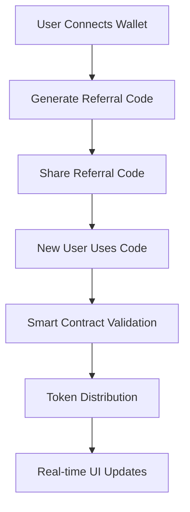
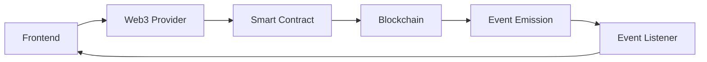

# 🏗️ System Architecture Documentation

## Overview

The Referral Rewards System is a comprehensive Web3 application built with a modern, scalable architecture that combines secure smart contracts with an intuitive frontend interface.

## 🎯 Architecture Principles

### Core Principles
- **Security First** - All components designed with security as the primary concern
- **Modularity** - Loosely coupled components for maintainability and scalability
- **Type Safety** - Full TypeScript implementation for reliability
- **User Experience** - Intuitive design with comprehensive error handling
- **Performance** - Optimized for fast loading and smooth interactions

### Design Patterns
- **Component-Based Architecture** - Reusable, composable UI components
- **Hook-Based State Management** - Custom React hooks for business logic
- **Event-Driven Updates** - Real-time blockchain event monitoring
- **Separation of Concerns** - Clear boundaries between UI, business logic, and data

## 🔗 System Components

### 1. Smart Contract Layer

#### ReferralToken.sol
```solidity
Purpose: ERC20 token with controlled minting
Key Features:
- Maximum supply cap (100M tokens)
- Initial supply minting (10M tokens)
- Role-based minting permissions
- Pausable transfers for emergency control
- Burn functionality for token management
```

#### ReferralSystem.sol
```solidity
Purpose: Core referral logic and reward distribution
Key Features:
- Secure referral processing
- Anti-spam rate limiting
- Role-based access control
- Comprehensive event logging
- Emergency pause functionality
```

### 2. Frontend Application Layer

#### Component Architecture
```
src/
├── components/
│   ├── enhanced/           # Feature-rich components
│   │   ├── EnhancedDashboard.tsx
│   │   ├── EnhancedReferralInput.tsx
│   │   └── EnhancedReferralGenerator.tsx
│   ├── ui/                 # Reusable UI primitives
│   │   ├── LoadingSpinner.tsx
│   │   ├── ProgressBar.tsx
│   │   ├── StatusBadge.tsx
│   │   └── Tooltip.tsx
│   └── core/               # Core application components
│       ├── Dashboard.tsx
│       ├── Leaderboard.tsx
│       └── WalletConnect.tsx
```

#### State Management
```typescript
// Custom hooks for business logic
useContract()    // Smart contract interactions
useWallet()      // Wallet connection and management
```

## 🔄 Data Flow

### 1. User Interaction Flow


### 2. Smart Contract Interaction Flow


## 🛡️ Security Architecture

### Smart Contract Security

#### Access Control
```solidity
// Role-based permissions
bytes32 public constant BACKEND_ROLE = keccak256("BACKEND_ROLE");

// Owner-only functions
modifier onlyOwner() { ... }

// Backend-only functions
modifier onlyBackend() { ... }
```

#### Anti-Spam Mechanisms
```solidity
// Rate limiting
mapping(address => uint256) public lastReferralTime;
uint256 public minReferralInterval;

// Maximum referrals per user
mapping(address => uint256) public totalReferrals;
uint256 public maxReferralsPerUser;
```

#### Emergency Controls
```solidity
// Pausable functionality
contract ReferralSystem is Pausable {
    function pause() external onlyOwner { _pause(); }
    function unpause() external onlyOwner { _unpause(); }
}
```

### Frontend Security

#### Input Validation
```typescript
// Type-safe input validation
const validateReferralCode = (code: string): boolean => {
  return /^REF_[A-F0-9]{6}$/.test(code);
};
```

#### Error Handling
```typescript
// Comprehensive error boundaries
try {
  await processReferral(code);
} catch (error) {
  handleContractError(error);
}
```

## 📊 Data Models

### TypeScript Interfaces

#### User Model
```typescript
interface User {
  address: string;
  referralCode: string;
  totalReferrals: number;
  totalRewards: string;
  pendingRewards: string;
  isReferred: boolean;
  lastReferralTime: number;
  isEligible: boolean;
}
```

#### Referral Model
```typescript
interface Referral {
  referee: string;
  referrer: string;
  timestamp: number;
  referrerReward: string;
  refereeReward: string;
  txHash?: string;
}
```

#### Contract Event Model
```typescript
interface ContractEvent {
  event: string;
  args: any[];
  transactionHash: string;
  blockNumber: number;
}
```

### Smart Contract Data Structures

#### Referral Struct
```solidity
struct Referral {
    address referee;
    address referrer;
    uint256 timestamp;
    uint256 referrerReward;
    uint256 refereeReward;
}
```

## 🔌 Integration Points

### Blockchain Integration

#### Web3 Provider Setup
```typescript
const provider = new ethers.BrowserProvider(window.ethereum);
const signer = await provider.getSigner();
```

#### Contract Instantiation
```typescript
const contract = new ethers.Contract(
  CONTRACT_ADDRESS,
  CONTRACT_ABI,
  signer
);
```

#### Event Listening
```typescript
contract.on('ReferralProcessed', (referee, referrer, timestamp) => {
  // Handle real-time updates
});
```

### External Services

#### Infura RPC
```typescript
const rpcUrl = `https://sepolia.infura.io/v3/${PROJECT_ID}`;
```

#### Etherscan API
```typescript
const explorerUrl = `https://sepolia.etherscan.io/tx/${txHash}`;
```

## 🎨 UI/UX Architecture

### Design System

#### Color System
```typescript
const colors = {
  primary: 'blue-600',      // Trust, reliability
  secondary: 'purple-600',  // Innovation, Web3
  success: 'green-600',     // Positive actions
  warning: 'yellow-600',    // Caution
  error: 'red-600',         // Problems
  neutral: 'gray-600'       // Content hierarchy
};
```

#### Component Hierarchy
```
App
├── Header (Navigation, Wallet Connection)
├── Main Content
│   ├── Dashboard (Stats, History)
│   ├── Referral (Code Generation, Input)
│   ├── Leaderboard (Rankings)
│   └── Events (Real-time Feed)
└── Footer (Links, Information)
```

### Responsive Design

#### Breakpoint Strategy
```css
/* Mobile First Approach */
@media (min-width: 640px)  { /* sm */ }
@media (min-width: 768px)  { /* md */ }
@media (min-width: 1024px) { /* lg */ }
@media (min-width: 1280px) { /* xl */ }
```

## 🚀 Performance Architecture

### Frontend Optimization

#### Code Splitting
```typescript
// Lazy loading for better performance
const Dashboard = lazy(() => import('./components/Dashboard'));
```

#### Memoization
```typescript
// Prevent unnecessary re-renders
const MemoizedComponent = memo(Component);
```

#### Efficient State Updates
```typescript
// Optimized state management
const [state, setState] = useState(initialState);
const updateState = useCallback((newData) => {
  setState(prev => ({ ...prev, ...newData }));
}, []);
```

### Smart Contract Optimization

#### Gas Efficiency
```solidity
// Packed structs for storage efficiency
struct PackedData {
    uint128 value1;  // 16 bytes
    uint128 value2;  // 16 bytes
    // Total: 32 bytes (1 storage slot)
}
```

#### Event Optimization
```solidity
// Indexed parameters for efficient filtering
event ReferralProcessed(
    address indexed referee,
    address indexed referrer,
    uint256 timestamp
);
```

## 🔄 State Management

### React State Architecture

#### Local Component State
```typescript
// Component-specific state
const [loading, setLoading] = useState(false);
const [error, setError] = useState<string | null>(null);
```

#### Custom Hooks
```typescript
// Shared business logic
const { user, loading, processReferral } = useContract();
const { isConnected, address, connectWallet } = useWallet();
```

#### Context Providers
```typescript
// Global application state
const AppContext = createContext<AppState>(defaultState);
```

### Blockchain State Synchronization

#### Event-Driven Updates
```typescript
// Real-time blockchain state sync
useEffect(() => {
  const handleEvent = (event) => {
    updateLocalState(event);
  };
  
  contract.on('EventName', handleEvent);
  return () => contract.off('EventName', handleEvent);
}, [contract]);
```

## 🧪 Testing Architecture

### Testing Strategy

#### Unit Tests
```typescript
// Component testing
describe('ReferralInput', () => {
  it('validates referral codes correctly', () => {
    // Test implementation
  });
});
```

#### Integration Tests
```typescript
// End-to-end user flows
describe('Referral Process', () => {
  it('completes full referral workflow', async () => {
    // Test implementation
  });
});
```

#### Smart Contract Tests
```solidity
// Contract functionality testing
contract ReferralSystemTest {
    function testReferralProcessing() public {
        // Test implementation
    }
}
```

## 📈 Scalability Considerations

### Horizontal Scaling

#### Component Modularity
- Independent, reusable components
- Clear separation of concerns
- Minimal coupling between modules

#### Service Architecture
- Microservice-ready design
- API-first approach
- Stateless component design

### Vertical Scaling

#### Performance Optimization
- Efficient algorithms and data structures
- Minimal re-renders and state updates
- Optimized smart contract interactions

#### Resource Management
- Memory-efficient state management
- Lazy loading and code splitting
- Efficient event handling

## 🔮 Future Architecture Considerations

### Planned Enhancements

#### Backend Service Integration
```typescript
// API service for referral code mapping
interface ReferralAPI {
  mapCode(code: string, address: string): Promise<void>;
  getAddress(code: string): Promise<string>;
}
```

#### Advanced Analytics
```typescript
// Analytics service integration
interface AnalyticsService {
  trackEvent(event: string, data: any): void;
  getUserMetrics(address: string): Promise<UserMetrics>;
}
```

#### Multi-Chain Support
```typescript
// Chain-agnostic architecture
interface ChainConfig {
  chainId: number;
  rpcUrl: string;
  contracts: ContractAddresses;
}
```

## 📚 Documentation Standards

### Code Documentation

#### TypeScript Interfaces
```typescript
/**
 * Represents a user in the referral system
 * @interface User
 */
interface User {
  /** Ethereum address of the user */
  address: string;
  /** Unique referral code for sharing */
  referralCode: string;
  // ... other properties
}
```

#### Smart Contract Documentation
```solidity
/**
 * @title ReferralSystem
 * @dev Complete referral rewards system with security features
 * @author Referral Rewards System
 */
contract ReferralSystem {
    /**
     * @dev Process a referral and distribute rewards
     * @param _referee Address of the referee (new user)
     * @param _referrer Address of the referrer (existing user)
     */
    function processReferral(address _referee, address _referrer) external;
}
```

---

This architecture provides a solid foundation for a scalable, secure, and maintainable referral rewards system that can grow with user needs and technological advances.